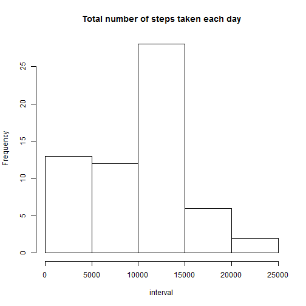
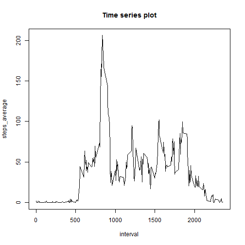
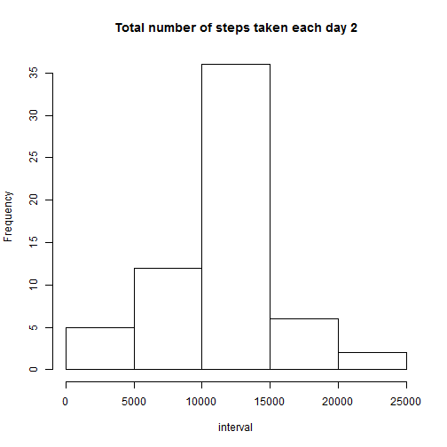
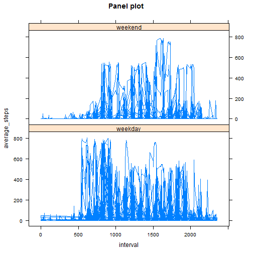

# Loading and preprocessing data

1. Load the data.


```r
a=read.csv("activity.csv", header=T, sep=",")
```

2. Process/transform the data(if necessary)


```r
x=a
```

## What is mean total number of steps taken per day?

1. Histogram of the total number of steps each day


```r
a=na.omit(a)
data1=sapply(split(a$steps, a$date), sum)
hist(data1, main="Total number of steps taken each day", xlab="interval")
```

 

2. Mean and median of total number of steps taken per day


```r
mean_steps <- mean(data1)  
median_steps <- median(data1)
```

The mean of total number of steps per day is 9354.2295082 and the median is 10395.

### What is the average daily activity pattern?

1. Time series plot


```r
b=sapply(split(a$steps, a$interval), mean)
inter=as.numeric(names(b))
steps_average=as.vector(b)
data2=data.frame(inter, steps_average)
plot(data2, type="l", main="Time series plot", xlab="interval")
```

 

2. 5-minute interval contains the max steps


```r
max <- max(data2[ ,2])
```

The max steps on average across all the days in dataset is contained in 206.1698113 of the          5-interval minute

#### Imputing missing values

1. Total number of missing values


```r
missing <- nrow(x)-nrow(a)
```

The total number of missing values is 2304.

2. Filling in all of the missing values in the datasets


```r
for(i in 1:nrow(x)){
    if(is.na(x[i, 1])==TRUE){
    l=x[,3][i]
    l1=which(data2[ ,1]==l)
    l2=data2[l1, 2]
    x[,1][i]=l2     
   }
}
```

3. New dataset


```r
y=x
```

The new dataset with the missing data filled is in y variable.

4. Histogram of the total number of steps taken each days (with new dataset)


```r
data3=sapply(split(y$steps, y$date), sum)
hist(data3, main="Total number of steps taken each day 2", xlab="interval")
```

 

```r
meanfilled <- mean(data3)   
medianfilled <- median(data3)
```

The mean of total number of steps taken per day for this step is 1.0766189 &times; 10<sup>4</sup> and the median is 1.0766189 &times; 10<sup>4</sup>.
These values differs from the estimates from the first part of the assignment.
Imputing missing data on the estimates of the total daily number of steps have modified significatively the values of mean and median in this second part.

##### Are these differences in activity patterns between weekdays and weekends?

1. Create a new factor variable in the dataset with two levels - "weekday" and "weekend" indicating whether a given date is a weekday or weekend day.


```r
y[ ,4] <- weekdays(as.Date(y$date))
for(i in 1:nrow(y)){
if(y[i, 4]=="lundi"|y[i, 4]=="mardi"|y[i, 4]=="mercredi"|y[i, 4]=="jeudi"|y[i, 4]=="vendredi")        
{y[i, 4]="weekday"}
else{y[i, 4]="weekend"}
}
```

2. Panel plot


```r
library(lattice)
xyplot(y$steps~y$interval|y$V4, type="l", layout=c(1, 2), xlab="interval",ylab="average_steps", main="Panel plot")
```

 


